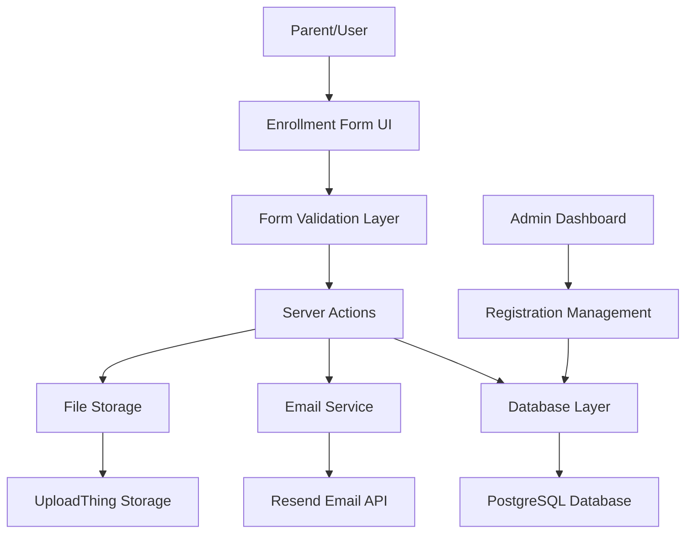
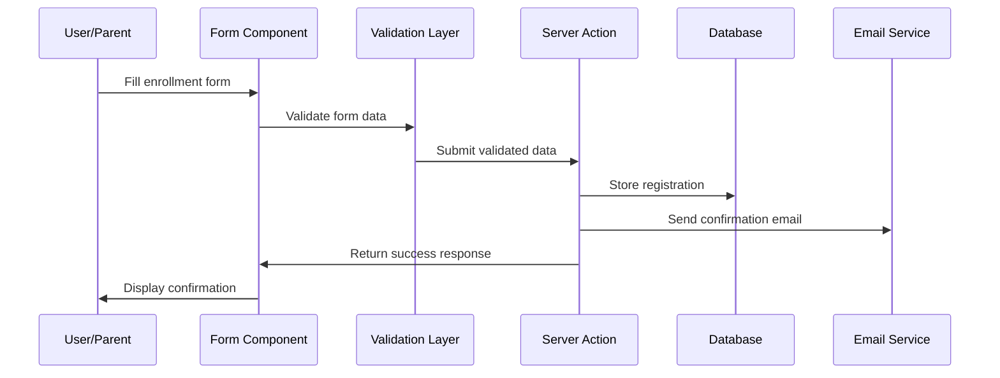
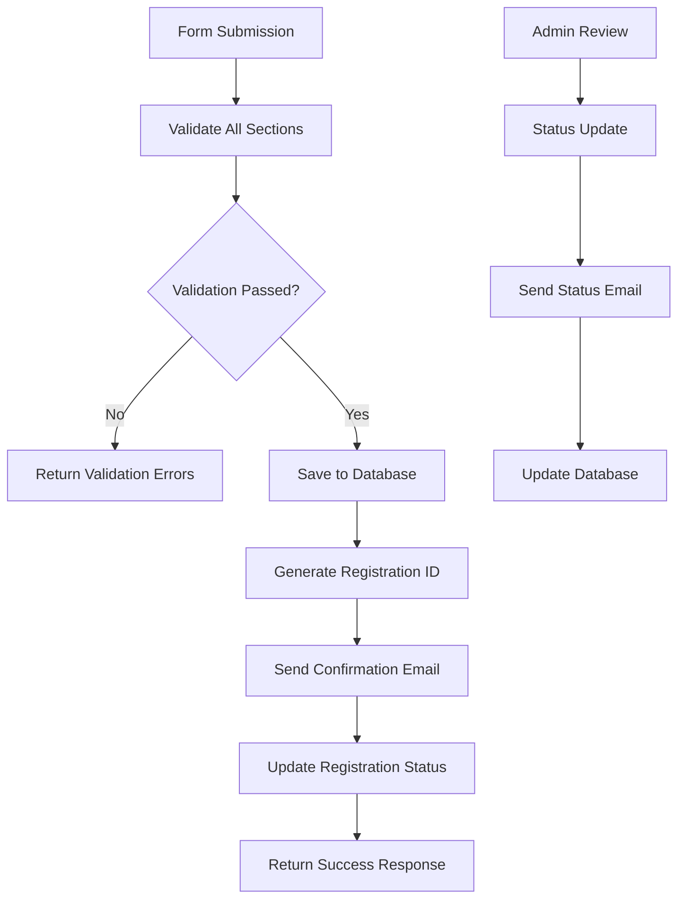

# École Isoko Form Submission System Design

## Overview

This design outlines the implementation of a comprehensive student enrollment form submission system for École Isoko's 2025-2026 academic year. The system will digitize the current paper-based enrollment process, enabling parents to submit student registration information online and allowing school administrators to manage and review submissions efficiently.

The system addresses the need to modernize the enrollment process while maintaining compliance with school administrative requirements and data collection standards.

## Technology Stack & Dependencies

- **Framework**: Next.js 14 with App Router
- **Language**: TypeScript for type safety
- **Database**: PostgreSQL with Drizzle ORM
- **Form Management**: React Hook Form with Zod validation
- **UI Components**: Radix UI primitives with Tailwind CSS
- **Email Service**: Resend for notifications
- **File Storage**: UploadThing for document/photo uploads
- **Authentication**: Custom OTP system (existing)

## Architecture

### System Architecture Overview



### Data Flow Architecture



## Component Architecture

### Form Component Hierarchy

```
EnrollmentForm (Main Container)
├── StudentInfoSection
│   ├── PersonalDetails
│   ├── AddressInfo
│   └── GradeSelection
├── PreviousSchoolingSection
│   └── SchoolHistoryTable
├── ParentGuardianSection
│   ├── MotherInfo
│   ├── FatherInfo
│   └── LegalGuardianSelection
├── SiblingSection
│   └── SiblingTable
├── EmergencyContactsSection
│   └── ContactPersonList
├── HealthInfoSection
│   ├── VaccinationStatus
│   ├── AllergiesInfo
│   ├── DietaryRequirements
│   └── MedicalConditions
├── SpecialNeedsSection
│   └── LearningDifficulties
├── AuthorizationsSection
│   └── PermissionCheckboxes
└── DocumentUploadSection
    ├── PhotoUpload
    ├── IdentityDocumentUpload
    └── PreviousSchoolRecords
```

### Component Definitions

#### EnrollmentForm Component
- **Purpose**: Main form container orchestrating all sections
- **Props**: None (root component)
- **State**: Form data, validation errors, submission status
- **Key Methods**: `handleSubmit()`, `validateSection()`, `saveProgress()`

#### StudentInfoSection Component
- **Purpose**: Captures basic student information
- **Props**: `formData`, `onUpdate`, `errors`
- **Fields**: Name, gender, birth date/place, nationality, address, grade level
- **Validation**: Required fields, date format, address format

#### ParentGuardianSection Component
- **Purpose**: Collects parent/guardian information
- **Props**: `formData`, `onUpdate`, `errors`
- **Features**: Separate forms for mother/father, legal guardian selection
- **Validation**: Email format, phone number format, required contact info

#### HealthInfoSection Component
- **Purpose**: Medical and health-related information
- **Props**: `formData`, `onUpdate`, `errors`
- **Features**: Vaccination tracking, allergy management, dietary restrictions
- **Validation**: Medical information completeness

#### DocumentUploadSection Component
- **Purpose**: Handle file uploads for required documents
- **Props**: `onFileUpload`, `uploadProgress`, `errors`
- **Features**: Drag-and-drop, file type validation, progress tracking
- **Supported Files**: Photos, ID documents, school records

### Props/State Management

#### Form State Structure
```typescript
interface EnrollmentFormData {
  student: StudentInfo;
  previousSchooling: SchoolHistory[];
  parents: ParentInfo;
  siblings: SiblingInfo[];
  emergencyContacts: EmergencyContact[];
  healthInfo: HealthData;
  specialNeeds: SpecialNeedsInfo;
  authorizations: AuthorizationData;
  documents: UploadedDocument[];
}
```

#### State Management Strategy
- **Local State**: React Hook Form for form state management
- **Validation State**: Zod schemas for type-safe validation
- **Upload State**: Separate state for file upload progress
- **Submission State**: Loading, success, error states

### Lifecycle Methods/Hooks

#### Custom Hooks
- `useEnrollmentForm()`: Main form logic and state management
- `useDocumentUpload()`: File upload handling and progress
- `useFormPersistence()`: Auto-save functionality
- `useFormValidation()`: Section-by-section validation

## API Integration Layer

### Server Actions

#### createEnrollmentRegistration
```typescript
async function createEnrollmentRegistration(
  formData: EnrollmentFormData
): Promise<{ success: boolean; registrationId?: string; error?: string }>
```

#### uploadDocument
```typescript
async function uploadDocument(
  file: File,
  documentType: DocumentType,
  registrationId: string
): Promise<{ success: boolean; fileUrl?: string; error?: string }>
```

#### getRegistrationById
```typescript
async function getRegistrationById(
  id: string
): Promise<{ registration?: EnrollmentRegistration; error?: string }>
```

#### getAllRegistrations
```typescript
async function getAllRegistrations(
  filters?: RegistrationFilters
): Promise<{ registrations: EnrollmentRegistration[]; total: number }>
```

### API Routes

#### /api/enrollments
- **POST**: Create new enrollment registration
- **GET**: Retrieve registrations (admin only)

#### /api/enrollments/[id]
- **GET**: Retrieve specific registration
- **PUT**: Update registration status
- **DELETE**: Remove registration

#### /api/documents/upload
- **POST**: Handle document uploads

## Data Models & ORM Mapping

### Database Schema

#### Enrollment Registration Table
```sql
CREATE TABLE enrollment_registrations (
  id SERIAL PRIMARY KEY,
  submission_date TIMESTAMP DEFAULT NOW(),
  academic_year VARCHAR(20) NOT NULL,
  status VARCHAR(20) DEFAULT 'pending',
  
  -- Student Information
  student_name VARCHAR(255) NOT NULL,
  student_first_names TEXT,
  student_gender VARCHAR(1) CHECK (student_gender IN ('M', 'F')),
  student_birth_date DATE NOT NULL,
  student_birth_place VARCHAR(255),
  student_nationality_1 VARCHAR(100),
  student_nationality_2 VARCHAR(100),
  student_address TEXT,
  enrollment_grade VARCHAR(50) NOT NULL,
  
  -- Parent/Guardian Information
  legal_guardian VARCHAR(50),
  mother_name VARCHAR(255),
  mother_first_name VARCHAR(255),
  mother_marital_status VARCHAR(20),
  mother_address TEXT,
  mother_profession VARCHAR(255),
  mother_phone VARCHAR(20),
  mother_email VARCHAR(255),
  
  father_name VARCHAR(255),
  father_first_name VARCHAR(255),
  father_marital_status VARCHAR(20),
  father_address TEXT,
  father_profession VARCHAR(255),
  father_phone VARCHAR(20),
  father_email VARCHAR(255),
  
  -- Health Information
  vaccination_up_to_date BOOLEAN,
  medication_allergies TEXT,
  food_allergies TEXT,
  other_allergies TEXT,
  dietary_requirements VARCHAR(100),
  chronic_conditions TEXT,
  learning_difficulties TEXT,
  specialist_follow_up TEXT,
  
  -- Authorizations
  contact_sharing_authorized BOOLEAN DEFAULT FALSE,
  image_usage_authorized BOOLEAN DEFAULT FALSE,
  rules_accepted BOOLEAN DEFAULT FALSE,
  
  created_at TIMESTAMP DEFAULT NOW(),
  updated_at TIMESTAMP DEFAULT NOW()
);
```

#### Previous Schooling Table
```sql
CREATE TABLE previous_schooling (
  id SERIAL PRIMARY KEY,
  registration_id INTEGER REFERENCES enrollment_registrations(id),
  academic_year VARCHAR(20),
  class_level VARCHAR(50),
  school_name VARCHAR(255),
  school_address TEXT
);
```

#### Siblings Table
```sql
CREATE TABLE siblings (
  id SERIAL PRIMARY KEY,
  registration_id INTEGER REFERENCES enrollment_registrations(id),
  name VARCHAR(255),
  first_name VARCHAR(255),
  birth_date DATE,
  current_class VARCHAR(100),
  current_school VARCHAR(255)
);
```

#### Emergency Contacts Table
```sql
CREATE TABLE emergency_contacts (
  id SERIAL PRIMARY KEY,
  registration_id INTEGER REFERENCES enrollment_registrations(id),
  name VARCHAR(255),
  first_name VARCHAR(255),
  relationship VARCHAR(100),
  profession VARCHAR(255),
  phone VARCHAR(20),
  emergency_contact BOOLEAN DEFAULT FALSE,
  pickup_authorized BOOLEAN DEFAULT FALSE
);
```

#### Documents Table
```sql
CREATE TABLE registration_documents (
  id SERIAL PRIMARY KEY,
  registration_id INTEGER REFERENCES enrollment_registrations(id),
  document_type VARCHAR(50),
  file_name VARCHAR(255),
  file_url TEXT,
  file_size INTEGER,
  upload_date TIMESTAMP DEFAULT NOW()
);
```

### Drizzle ORM Schema Definitions

```typescript
export const enrollmentRegistrations = pgTable("enrollment_registrations", {
  id: serial("id").primaryKey(),
  submissionDate: timestamp("submission_date").defaultNow(),
  academicYear: varchar("academic_year", { length: 20 }).notNull(),
  status: varchar("status", { length: 20 }).default("pending"),
  
  // Student fields
  studentName: varchar("student_name", { length: 255 }).notNull(),
  studentFirstNames: text("student_first_names"),
  studentGender: varchar("student_gender", { length: 1 }),
  studentBirthDate: date("student_birth_date").notNull(),
  studentBirthPlace: varchar("student_birth_place", { length: 255 }),
  studentNationality1: varchar("student_nationality_1", { length: 100 }),
  studentNationality2: varchar("student_nationality_2", { length: 100 }),
  studentAddress: text("student_address"),
  enrollmentGrade: varchar("enrollment_grade", { length: 50 }).notNull(),
  
  // Parent fields
  legalGuardian: varchar("legal_guardian", { length: 50 }),
  motherName: varchar("mother_name", { length: 255 }),
  motherFirstName: varchar("mother_first_name", { length: 255 }),
  motherMaritalStatus: varchar("mother_marital_status", { length: 20 }),
  motherAddress: text("mother_address"),
  motherProfession: varchar("mother_profession", { length: 255 }),
  motherPhone: varchar("mother_phone", { length: 20 }),
  motherEmail: varchar("mother_email", { length: 255 }),
  
  fatherName: varchar("father_name", { length: 255 }),
  fatherFirstName: varchar("father_first_name", { length: 255 }),
  fatherMaritalStatus: varchar("father_marital_status", { length: 20 }),
  fatherAddress: text("father_address"),
  fatherProfession: varchar("father_profession", { length: 255 }),
  fatherPhone: varchar("father_phone", { length: 20 }),
  fatherEmail: varchar("father_email", { length: 255 }),
  
  // Health fields
  vaccinationUpToDate: boolean("vaccination_up_to_date"),
  medicationAllergies: text("medication_allergies"),
  foodAllergies: text("food_allergies"),
  otherAllergies: text("other_allergies"),
  dietaryRequirements: varchar("dietary_requirements", { length: 100 }),
  chronicConditions: text("chronic_conditions"),
  learningDifficulties: text("learning_difficulties"),
  specialistFollowUp: text("specialist_follow_up"),
  
  // Authorizations
  contactSharingAuthorized: boolean("contact_sharing_authorized").default(false),
  imageUsageAuthorized: boolean("image_usage_authorized").default(false),
  rulesAccepted: boolean("rules_accepted").default(false),
  
  createdAt: timestamp("created_at").defaultNow(),
  updatedAt: timestamp("updated_at").defaultNow()
});

export const previousSchooling = pgTable("previous_schooling", {
  id: serial("id").primaryKey(),
  registrationId: integer("registration_id").references(() => enrollmentRegistrations.id),
  academicYear: varchar("academic_year", { length: 20 }),
  classLevel: varchar("class_level", { length: 50 }),
  schoolName: varchar("school_name", { length: 255 }),
  schoolAddress: text("school_address")
});

export const siblings = pgTable("siblings", {
  id: serial("id").primaryKey(),
  registrationId: integer("registration_id").references(() => enrollmentRegistrations.id),
  name: varchar("name", { length: 255 }),
  firstName: varchar("first_name", { length: 255 }),
  birthDate: date("birth_date"),
  currentClass: varchar("current_class", { length: 100 }),
  currentSchool: varchar("current_school", { length: 255 })
});

export const emergencyContacts = pgTable("emergency_contacts", {
  id: serial("id").primaryKey(),
  registrationId: integer("registration_id").references(() => enrollmentRegistrations.id),
  name: varchar("name", { length: 255 }),
  firstName: varchar("first_name", { length: 255 }),
  relationship: varchar("relationship", { length: 100 }),
  profession: varchar("profession", { length: 255 }),
  phone: varchar("phone", { length: 20 }),
  emergencyContact: boolean("emergency_contact").default(false),
  pickupAuthorized: boolean("pickup_authorized").default(false)
});

export const registrationDocuments = pgTable("registration_documents", {
  id: serial("id").primaryKey(),
  registrationId: integer("registration_id").references(() => enrollmentRegistrations.id),
  documentType: varchar("document_type", { length: 50 }),
  fileName: varchar("file_name", { length: 255 }),
  fileUrl: text("file_url"),
  fileSize: integer("file_size"),
  uploadDate: timestamp("upload_date").defaultNow()
});
```

## Routing & Navigation

### Page Structure

#### /fiche-inscription (Enrollment Form Page)
- **Purpose**: Main enrollment form interface
- **Components**: EnrollmentForm, ProgressIndicator, SaveDraftButton
- **Features**: Multi-step form, auto-save, validation feedback

#### /admin/registrations (Admin Dashboard)
- **Purpose**: View and manage all registrations
- **Components**: RegistrationTable, FilterControls, ExportButton
- **Access**: Admin only (requires authentication)

#### /admin/registrations/[id] (Registration Details)
- **Purpose**: View specific registration details
- **Components**: RegistrationDetail, DocumentViewer, StatusUpdater
- **Features**: Full registration view, document downloads, status management

#### /registration-success (Confirmation Page)
- **Purpose**: Display submission confirmation
- **Components**: SuccessMessage, NextStepsInfo, ContactInfo
- **Features**: Registration ID display, payment instructions

### Navigation Flow

```mermaid
graph LR
    A[Home Page] --> B[/fiche-inscription]
    B --> C[Multi-step Form]
    C --> D[Document Upload]
    D --> E[Review & Submit]
    E --> F[/registration-success]
    
    G[Admin Login] --> H[/admin/registrations]
    H --> I[/admin/registrations/[id]]
    I --> J[Status Update]
    J --> H
```

## Business Logic Layer (Architecture of each feature)

### Form Validation Logic

#### Progressive Validation
- **Section-by-section validation**: Each form section validates independently
- **Real-time feedback**: Field validation on blur/change events
- **Cross-field validation**: Age-grade correspondence, contact information consistency
- **Document requirements**: Mandatory documents based on student status

#### Validation Rules
```typescript
const studentValidationSchema = z.object({
  name: z.string().min(2, "Nom requis (minimum 2 caractères)"),
  firstName: z.string().min(2, "Prénom requis"),
  gender: z.enum(["M", "F"], { required_error: "Sexe requis" }),
  birthDate: z.date().refine(date => {
    const age = new Date().getFullYear() - date.getFullYear();
    return age >= 2 && age <= 18;
  }, "Âge doit être entre 2 et 18 ans"),
  enrollmentGrade: z.string().min(1, "Niveau d'inscription requis")
});

const parentValidationSchema = z.object({
  motherEmail: z.string().email("Email invalide").optional(),
  fatherEmail: z.string().email("Email invalide").optional(),
  phone: z.string().regex(/^[\d\s\-\+\(\)]+$/, "Format de téléphone invalide")
}).refine(data => data.motherEmail || data.fatherEmail, {
  message: "Au moins un email parent requis"
});
```

### Document Management Logic

#### Upload Processing
- **File type validation**: PDF, JPEG, PNG for documents; JPEG, PNG for photos
- **Size limits**: 5MB per document, 2MB for photos
- **Virus scanning**: Integration with file scanning service
- **Storage organization**: Files organized by registration ID and document type

#### Document Requirements Engine
```typescript
interface DocumentRequirement {
  type: 'student_photo' | 'identity_document' | 'school_records' | 'payment_proof';
  required: boolean;
  description: string;
  maxSize: number;
  allowedTypes: string[];
}

const getRequiredDocuments = (studentInfo: StudentInfo): DocumentRequirement[] => {
  const requirements: DocumentRequirement[] = [
    {
      type: 'student_photo',
      required: true,
      description: 'Photo passport de l\'enfant',
      maxSize: 2 * 1024 * 1024, // 2MB
      allowedTypes: ['image/jpeg', 'image/png']
    },
    {
      type: 'identity_document',
      required: true,
      description: 'Carte d\'identité ou passeport',
      maxSize: 5 * 1024 * 1024, // 5MB
      allowedTypes: ['application/pdf', 'image/jpeg', 'image/png']
    }
  ];
  
  // Add school records requirement for new students
  if (isNewStudent(studentInfo)) {
    requirements.push({
      type: 'school_records',
      required: true,
      description: 'Attestation de fréquentation scolaire',
      maxSize: 5 * 1024 * 1024,
      allowedTypes: ['application/pdf']
    });
  }
  
  return requirements;
};
```

### Registration Processing Logic

#### Submission Workflow


#### Status Management
- **pending**: Initial submission status
- **under_review**: Admin is reviewing the registration
- **additional_info_required**: Missing or incorrect information
- **approved**: Registration approved for enrollment
- **rejected**: Registration denied
- **enrolled**: Student officially enrolled

### Email Notification System

#### Notification Types
- **Submission Confirmation**: Sent immediately after form submission
- **Status Updates**: Sent when admin changes registration status
- **Payment Reminders**: Automated reminders for outstanding fees
- **Document Requests**: When additional documents are needed

#### Email Templates
```typescript
interface EmailTemplate {
  type: 'confirmation' | 'status_update' | 'payment_reminder' | 'document_request';
  subject: string;
  template: string;
  variables: string[];
}

const confirmationEmailTemplate = {
  type: 'confirmation',
  subject: 'Confirmation d\'inscription - École Isoko',
  template: `
    Bonjour {{parentName}},
    
    Nous avons bien reçu votre demande d'inscription pour {{studentName}}.
    Numéro de dossier: {{registrationId}}
    
    Prochaines étapes:
    1. Paiement des frais d'inscription (50 USD)
    2. Révision du dossier par notre équipe
    3. Confirmation d'admission
    
    Cordialement,
    L'équipe École Isoko
  `,
  variables: ['parentName', 'studentName', 'registrationId']
};
```

## Testing Strategy

### Unit Testing Approach

#### Component Testing
- **Form validation logic**: Test all validation rules and error messages
- **State management**: Test form state updates and persistence
- **File upload handling**: Test upload progress and error scenarios
- **Email formatting**: Test email template generation

#### API Testing
- **Endpoint validation**: Test all API routes with valid/invalid data
- **Database operations**: Test CRUD operations on enrollment data
- **Error handling**: Test error responses and status codes
- **File upload endpoints**: Test document upload functionality

#### Integration Testing
- **Form submission flow**: End-to-end submission process
- **Email delivery**: Test email notifications are sent correctly
- **Admin dashboard**: Test registration management features
- **File storage**: Test document upload and retrieval

### Test Data Management
- **Mock student data**: Realistic test data for form testing
- **Document samples**: Test files for upload functionality
- **Email templates**: Test email generation and delivery
- **Database seeding**: Populate test database with sample registrations